# CKA - UDEMY CKA 강의 내용 정리

https://lg-cns.udemy.com/course/certified-kubernetes-administrator-with-practice-tests/learn/lecture/14298420#overview  
✔ 해당 영상의 내용을 바탕으로 정리한 문서입니다.  

------------------------------------------------------------------------
## 🔎 <b>ETCD
+ ETCD란?
>1. K8s 기반 스토리지이며 모든 데이터가 ETCD에 보관된다. 클러스터에 어떤 노드가 몇개있고 어떤 파드가 어떤 노드에서 동작하는지 등등
>2. ETCD is a distributed reliable <b>key-value store<b> that is Simple, Secure & Fast   
>> key-value store?  
>> + RDB 형태가 아니라 key, value 두가지 컬럼을 가진 DB  
>> + Data가 복잡해지면 Jason / YANO를 사용한다.
>3. 2013년 8월 출시, 2018년 11월 CNCF Incubation (Version 3)  
>( version 2 -> 3 넘어갈때 API에 많은 변화가 생김 )  
> .  
> 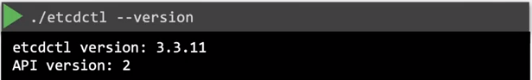  
>버전 확인을 해봤다. 위에는 ETCD Utility version, 아래는 ETCD API version이다.  
>ETCD v3 이상은 API version : 3이 Default이다.  
> .   
> 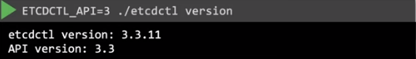  
>API 버전 바꾸고 싶으면 이런식으로 하면 된다.  
>.

---
## 🔎 <b>쿠버네티스 아키텍처구조</b>
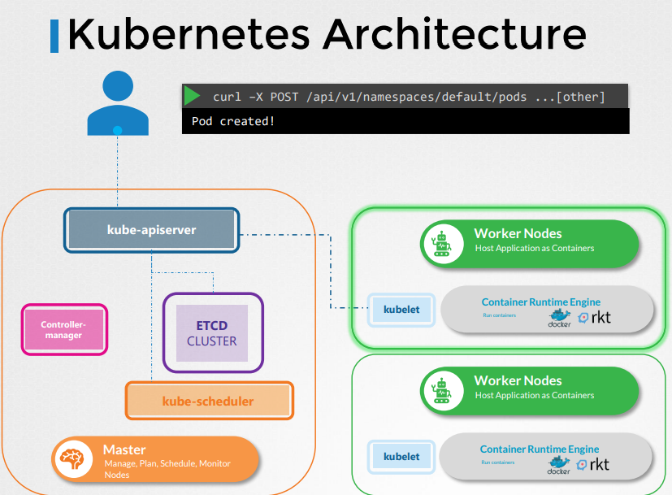
* 간단한 아키텍처 흐름을 알아보자
>1. 사용자가 kubectl 커맨드를 실행하면, kubectl utility가 kube-apiserver에 접근한다.  
>2. kube-apiserver는 사용자의 명령에 대해 Authentication, Validation을 한다.
>3. 검증 절차를 통과하면 ETCD Cluster에서 요청받은 정보를 돌려준다. 
* Pod를 생성할때 아키텍처 흐름은 어떨까?
>1. 만약 Pod를 만든다고하면, 우선 api server가 Auth, Valid를 한다. (api server는 노드를 할당해주지 않는다.)  
>2. 그 후 User가 pod를 생성한다는 정보를 ETCD에 update한다.  
>3. 이때 kube-scheduler는 게속해서 apiserver를 모니터링한다.  
>4. node가 할당되지 않은 새로운 파드가 있다고 판단되면 scheduler는 올바른 노드를 식별해 새로운 파드를 해당 노드에 할당하고, api server에 알린다.  
>5. api server는 내용을 다시 etcd에 알리고 etcd는 데이터를 update한다.  
>6. api server는 생성된 node가 있는 worker node에도 정보를 전달한다.  
>7. 그러면 받은 정보대로 kublet은 pod를 생성한다.  
>8. kublet은 worker node 내의 Container Runtime Engine에 이미지 배포를 위해 정보를 전달한다.  
>9. 완료되면 kublet은 다시 api server로 업데이트된 데이터를 전달하고 api server는 다시 etcd로 데이터를 전달한다. 당연히 etcd는 다시 데이터를 update 한다.  

---
## 🔎 <b>Kube-Controller Manager
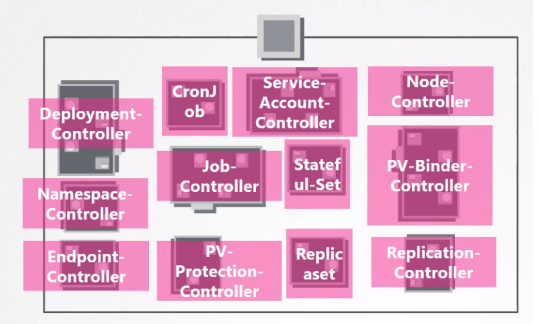  
* 그림과 같이 다양한 Controller가 존재하며, 이런 Controller를 관리하는 역할을 한다.

---
## 🔎 <b>Kube Scheduler
* Kube Scheduler는 Pod가 어느 Node에 위치 할 지 정해주는 역할을 한다.   
* Pod의 리소스에 맞게 최적의 Node를 선별하는 기준을 갖고 있다. (Filter Nodes, Rank Nodes 등)
* 실제로 Pod를 위치시키는 것은 Kube Scheduler가 정한 Worker Node의 Kubelet이다.

---
## 🔎 <b>Kubelet
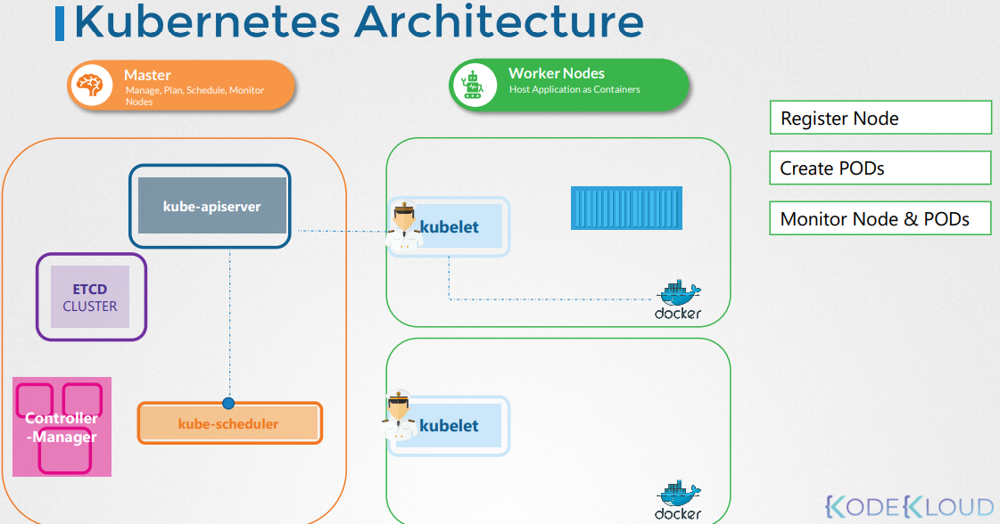
* Kublet Architecture Flow를 알아보자!
>1. Kublet이 container나 Pod를 노드에 적재하라는 요청을 받으면, Docker와 같은 Container Runtime Engine에 필요한 이미지 Pull을 하기위한 요청을 보내고 instance를 실행한다.
>2. Kubelet은 Container, Pod의 상태를 모니터링하면서 동시에 API Server에 reporting한다.
>3. kubeadm은 kubelets을 배포하지 않기 때문에 수동으로 설치해야한다.

---
## 🔎 <b>Kube Proxy
* Service는 K8s Memory에만 있는 가상의 개념이다. 이 Service는 I/F나 listener가 없다. 그런데 Service는 Cluster를 통해 어느 Node에서나 접근 가능해야한다. 어떻게???  
 ⇒  이때 필요한게 'Kube-Proxy' 이다.
* 아래 그림처럼 Kube Proxy는 모든 Worker Node에 위치해있다. (이런 배치를 DaemonSet이라고 한다.)
 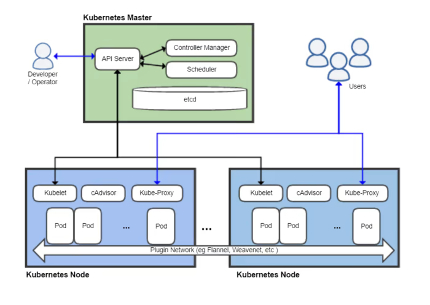
 
⭕ Pod간 I/F flow  
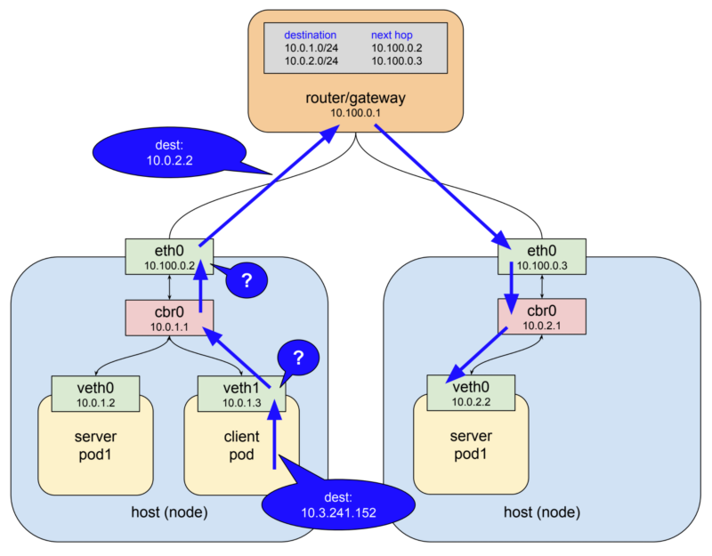
>* Worker Node에는 두가지 Interface가 있다. Host I/F (그림의 eth0), Pod I/F (그림의 veth0)이다.  
K8s의 특성상 Node와 Pod는 쉽게 변경되기 때문에 Host,Pod I/F를 이용해 Pod간 통신을 하는 것은 무리가 있다.
>* router/gateway에 routing table이 설정돼있기 때문에 통신하려하는 Pod의 IP를 안다면 바로 해당 IP로 요청을 전달할 수 있지만 위에서 말한대로 Pod의 변경이 쉽게 일어나기때문에 동작하지 않을 수 있다.
>* Kube Proxy는 새로운 서비스를 찾고, 새로운 서비스가 생성되면 각 Node에 실시간으로 적절한 Rule을 생성한다. 이때 사용하는 Rule 중 하나가 <b><u>'iptables rule'</u></b> 이다.  
Kube Porxy는 새로운 Pod가 생성될 때 자신이 속해있는 Node의 iptables에 Rule을 추가한다.
>* 더 자세한 Network Flow는 뒤에서 다룰 예정이다.

---
## 🔎 <b>PODs
* K8s의 목적은 Application을 Worker Node에 구성된 Container에 구성하는 것이며, 이때 K8s는 Application을 바로 Container에 구성하지 않고 Pod 안에 감싸서 구성한다.  
✔ Pod는 K8s에서 생성할 수 있는 가장 작은 단위의 개념이다. 
* one application per one pod 
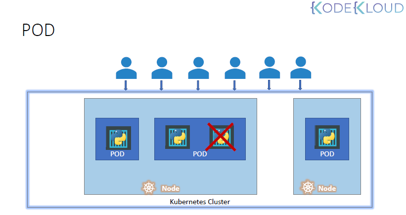  
> 1. Worker Node 안에 POD가 생성돼있고, POD 안에 Applicatoin이 동작하고 있다. 
> 2. Application 이용하는 User가 늘어나면, POD 안에 동일한 Application을 생성하는 것이 아니라 새로운 POD를 생성하고 그 안에 동일한 Application을 생성한다.
> 3. 여기서 사용자가 더 늘어났는데 사용중인 Worker Node의 수용 능력이 충분치 않다면, 새로운 Cluster에 Worker Node를 구성하고 동일한 Application을 가진 POD를 생성한다.

### ✅ POD를 만들어보자
1. yaml Configuration
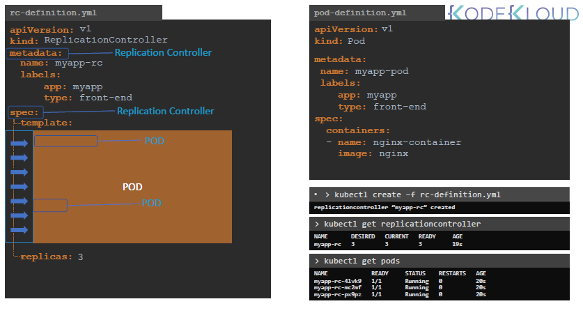
> * apiVersion, kind, metadata, spec은 가장 기본적인 4가지 top level property이다.
> * property간 들여쓰기에 의해 관계 레벨이 정의된다.

```yaml
apiVersion: v1
kind: Pod
metadata:
  name: nginx
  labels:
    app: nginx
    tier: frontend
spec: #spec은 dictionary
  containers:
   - name: nginx #새로운 parameter 시작 시 - 사용
     image: nginx # docker hub 사용한다면 full path 넣기
```

2. yml로 pod 생성 
```shell
kubectl apply -f pod.yml
```

3. 생성한 pod 확인  
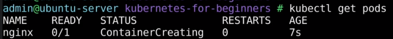
```shell
kubectl get pods <pod명>
kubectl get pods -o wide
kubectl describe pod <pod명>
```

4. 생성된 Pod 수정  
4-1) yml없이 image로 바로 pod 생성한 경우
```shell
kubectl edit pod redis
```
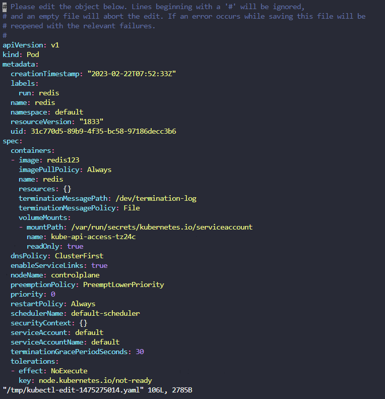

4-2) yml로 pod 생성한 경우
```shell
kubectl apply -f <yaml 파일명> 
```

---
# 🔎 **ReplicaSets**
* ReplicaSets을 사용하는 이유는 다음과 같다.  
> 1. High Availability   
>: Pod에 문제가 생겼을 시 새로운 Pod로 교체해준다.
> 2. Load Balancing & Scaling  
>: Application 사용량에 따라 ReplicaSets는 Node 및 Pod를 Scale out / Scale in 한다.
* ReplicaSet vs Replication Controller
> Replication Controller는 예전 기술이고, 요즘엔 ReplicaSet으로 대체되었다.  
> Replication 셋업 시 ReplicaSet의 사용을 추천한다.
 
 ### ✅ ReplicaSets를 만들어보자
1. yaml 생성
```yaml
apiVersion: v1
kind: ReplicationController
metadata:
  name: myapp-rc
  labels:
    app: myapp
    type: front-end
spec:
  template:
    metadata: #파드 구성하는 yaml의 spec이다.
      name: nginx
      labels:
        app: nginx
        tier: frontend
    spec:
      containers:
        - name: nginx
          image: nginx 
    replicas: 3
```

2. run